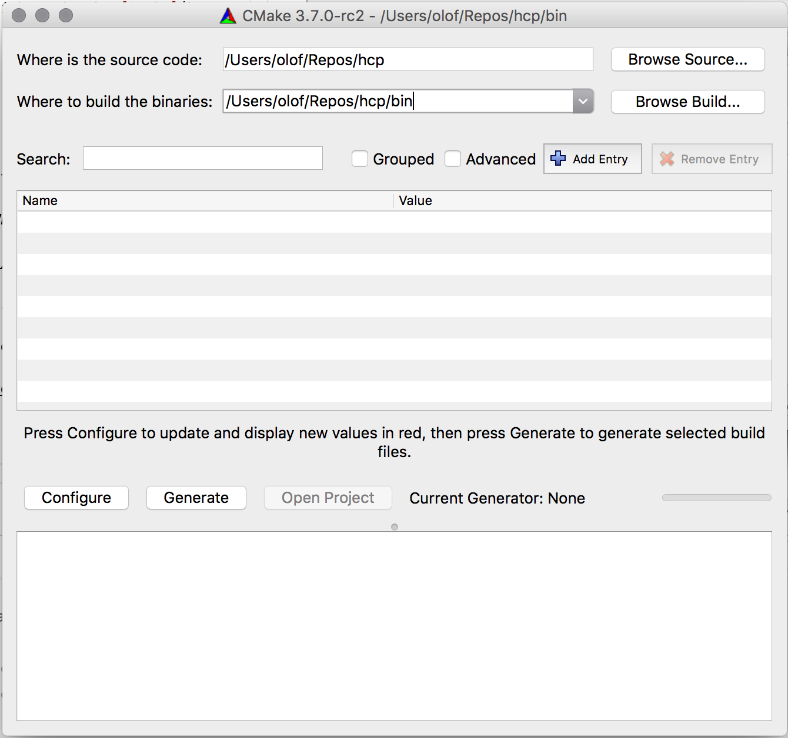
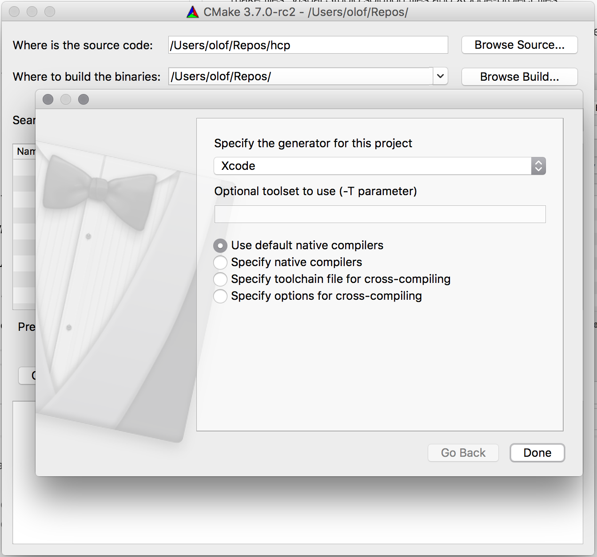
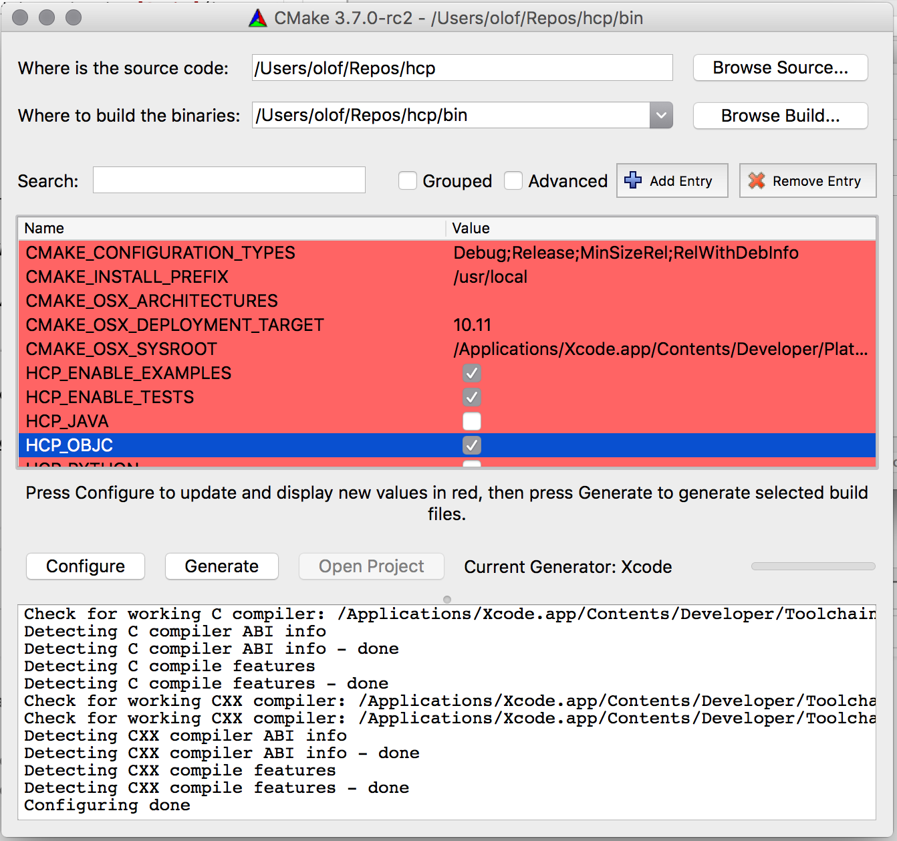
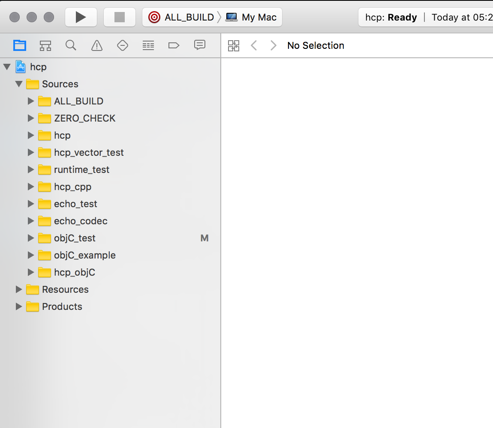
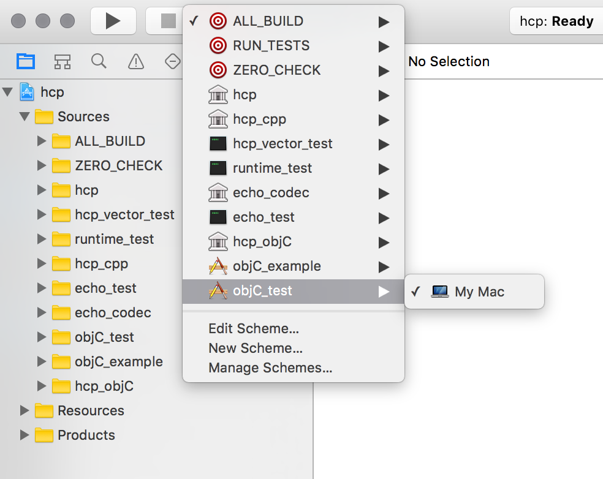
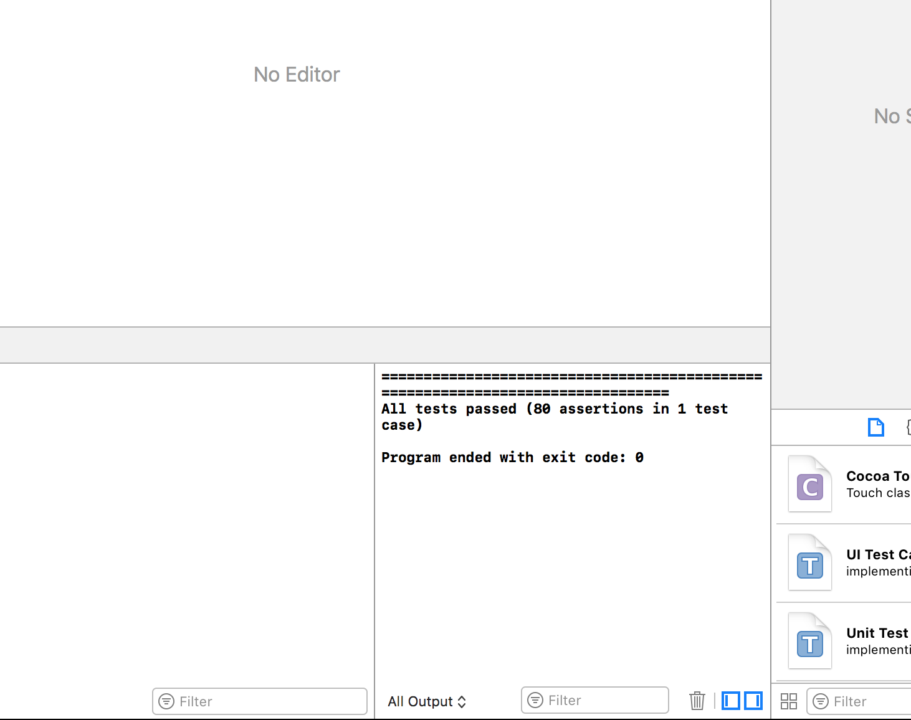
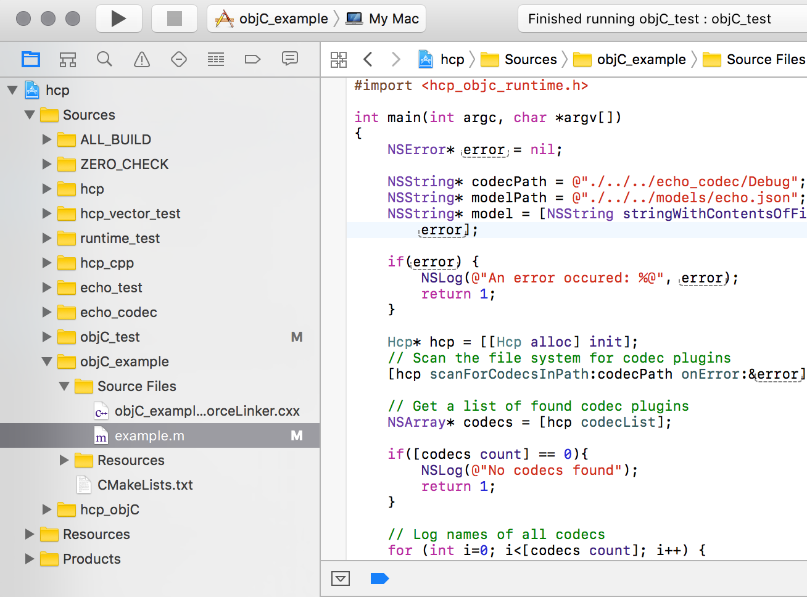
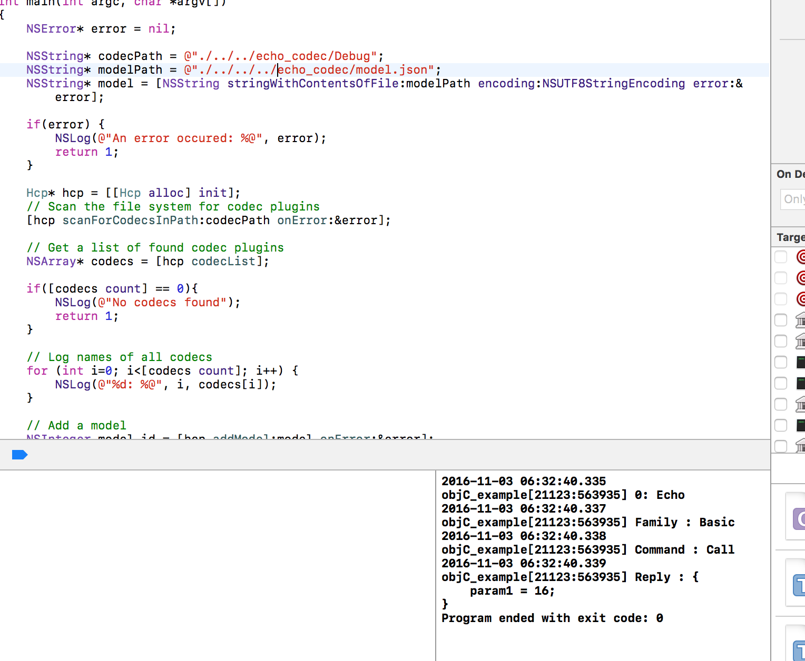

# Hcp Objective-C Walkthrough

This directory contains a Objective-C wrapper for Hcp. The current release is a *beta* release and should not be used in production. Later releases will be made avalible as pre-compiled binaries via Cocapods.

## Source and Tools

There are a number of steps involved when building Hcp, the first step is to download the source code and required tooling.

### 1. Hcp soure code

Move to the directory where you want the Hcp-repository to be cloned into.

```Bash
git clone https://github.com/husqvarnagroup/hcp.git
```

### 2. XCode

Head to [App Store](https://itunes.apple.com/us/app/xcode/id497799835?mt=12) or visit [Apple's XCode site](https://developer.apple.com/xcode/). However, no registration or subscription is required to download XCode - except an App Store account.

### 3. Home-Brew

Currently the Hcp build systems depends on pre-compiled versions of [libuv](https://github.com/libuv/libuv) which can be installed via [Home-brew](http://brew.sh/).

```Bash
/usr/bin/ruby -e "$(curl -fsSL https://raw.githubusercontent.com/Homebrew/install/master/install)"
```

If you receive: '**curl: (1) Protocol "https" not supported or disabled in libcurl**' when running the code above it means that you are using an updated version of cURL. Running a different (avalible) version of cURL will solve the problem. Try the line below before downloading a new cURL version.

```Bash
/usr/bin/ruby -e "$(/usr/bin/curl -fsSL https://raw.githubusercontent.com/Homebrew/install/master/install)"
```

### 4. Libraries

Currently Hcp uses only one external library for the Objective-C wrapper; libuv.

```Bash
brew install libuv
```

### 5. CMake

CMake can be installed either via the [CMake](https://cmake.org/download/) webpage or via Home-brew:

```Bash
brew install cmake
```

## Build configuration

Hcp uses CMake to generate build files for most popular build platforms such as gcc-make files, Visual Studio solution files and XCode-project files.

Start CMake and under *Where is the source* select the directory where Hcp was cloned.

In this example we will generate the output files to hcp/bin.

**NOTE: The examples shipped with the wrapper will only work if the binary directory is directly under the cloned hcp-directory, due to relative search paths to test files.**



*Where to build the binaries* should not be the Hcp-directory itself. A sub-directory is fine but allot of files will be generated and whould pollute the Hcp-directory.

Once the directories have been specified click *Configure*



While CMake have support for numerous project generators, this example will only cover XCode. Select the *Xcode* generator from the list. Then click *done*.

Once done, CMake presents the various projects that can be built. For this walkthrough we will build:

* HCP_OBJC - The objective-c wrapper itself.
* HCP_ENABLE_EXAMPLES - Example code.
* HCP_TESTS - Unit tests.



Hit generate and after a short while, CMake has created a xCode-project.

## Compile and test

Open a terminal, go to the output directory (*Where to build the binaryes*) and type:

```Bash
open hcp.xcodeproj
```

If everything went as planned (which it should...) you will get the following structure if *Hcp/Sources* is expanded.



Next we select which configuration to compile. We will start with the unit-test configuration which ensures that the most vital parts of Hcp is fully operational. Click at *ALL_BUILD*, select *objC_test*



Hit *Build and Run* and the following should be output:



The you get the same result as above it means that the following is working:

* The Hcp runtime is successfully executed by Objective-C.
* A model file was loaded and parsed.
* A dynamic-library codec was loaded and executed.

In short, if the unit test passes Hcp works as intended.

## Example app

The objective-c wrapper ships with a example app that uses a dummy codec (echo) to let developers start building their applications with having a proper codec library (and device!) at hand. Change the *Active scheme* to objC-example and expand the *objC_example/Source files* directory.



Open up example.m and walk though the code before hitting *Build and run*. If everything worked, you should get the following output:



Questions, suggestions or complaints can be sent [here](mailto:olof.andreassen@husqvarnagroup.com).
